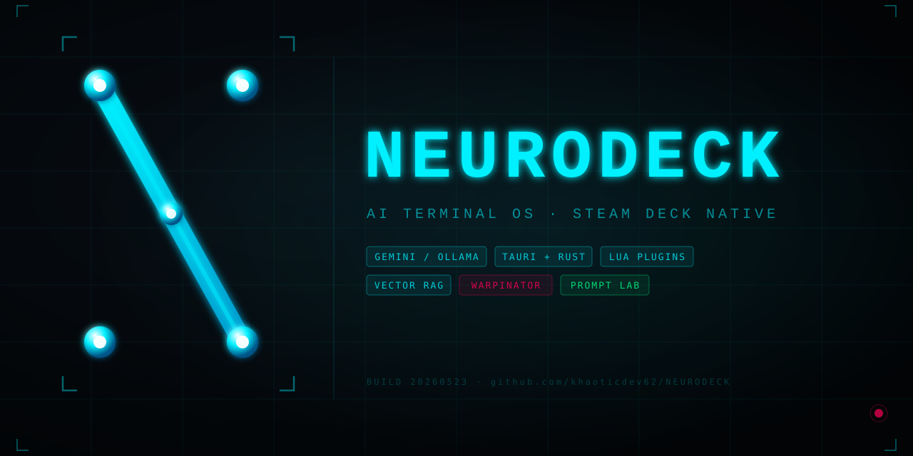

<div align="center">



<br/>

[](LICENSE)
[](https://www.rust-lang.org)
[](https://tauri.app)
[](https://store.steampowered.com/steamdeck)
[](https://ai.google.dev)
[](#)

<br/>

```
 ██████  The command center between your brain and the machine.
 ██  ██  AI chat · live canvas · PTY shell · autonomous agent
 ██  ██  vector memory · Warpinator gRPC · Lua plugins
 ██████  1280×800 · Steam Deck native · fullscreen OS overlay
```

</div>

---

## What It Is

NEURODECK is a fullscreen Tauri v2 desktop app that turns a Steam Deck into an AI-powered terminal OS. Everything runs in one 1280×800 window — no browser, no Electron, no overhead.

| Core capability | Implementation |
|---|---|
| LLM chat with streaming | Gemini API (SSE) or Ollama (local) |
| Vector memory + RAG | Cosine-similarity DB, injected per-message |
| Real PTY terminal | `portable-pty`, multi-session, bash/PowerShell |
| Live code canvas | HTML/CSS/JS preview, collaborative TCP sync |
| Autonomous agent | 5-step code-write-run-iterate loop |
| LAN file transfer | mDNS peer discovery + Warpinator gRPC (tonic 0.11) |
| Lua scripting | mlua 5.4, hot-loadable plugins, slash commands |
| Prompt Lab | 7 formula frameworks (AIDA/SCQA/PASTOR/CoT/ToT/PAS/Role) |
| OS keychain auth | `keyring` 2.x — Gemini key stored securely |
| SSH client | Profile-persisted sessions, PTY-backed |

---

## Quick Start

### Steam Deck / SteamOS

```bash
# Deploy to ~/Applications/neurodeck/
./install.sh

# Launch in gamescope (Game Mode)
./launch_gamescope.sh
```

### Development (any platform)

```bash
# Prerequisites: Rust 1.77.2, Node 18+
git clone https://github.com/khaoticdev62/NEURODECK.git
cd NEURODECK

npm install --prefix frontend
npm run tauri dev          # Hot-reload: Vite + Rust watch
```

### Windows package

```powershell
.\package_release.ps1      # Produces MSI installer
```

---

## Architecture

```
frontend/src/main.js          (~9500 lines, zero npm dependencies)
  └─ invoke("command", args)  ──►  src-tauri/src/lib.rs  (#[tauri::command])
  └─ listen("event", handler) ◄──  app_handle.emit("event", payload)

Streaming paths (LLM tokens, PTY output, agent steps) → emit()
Request/response (config, personas, themes, memory) → invoke()
```

### Crate layout

```
src-tauri/         Main Tauri app (lib.rs owns all command handlers)
  src/
    lib.rs         All #[tauri::command] handlers — AppState — themes — personas
    llm.rs         GeminiProvider + OllamaProvider + generate_embedding()
    lua.rs         mlua runtime — registerCommand / registerHook / setPersona
    pty_manager.rs Multi-session PTY via portable-pty
    memory.rs      Vector DB — cosine similarity — chat_history.json
    transfer.rs    LAN P2P + Warpinator gRPC server (STermWarpinatorCallbacks)
    canvas_collab.rs  TCP live canvas sync
    ftp.rs         FTP/SFTP via suppaftp (spawn_blocking wrapped)

infrastructure/    Platform services crate (path dep)
  src/
    secrets.rs     OS keychain — keyring 2.x
    oauth.rs       Google OAuth2 device flow
    warpinator.rs  Warpinator gRPC — tonic 0.11 — WarpinatorCallbacks trait

plugins/           Lua plugins — auto-loaded at startup
  bmad.lua         BMAD personas — /john /sally /winston /amelia /paige /mary
  promptgen.lua    Prompt Lab — /promptlab /promptgen /formula
  ip_lookup.lua    IP utilities
  auto_responder.lua  Response hooks
```

---

## Configuration

Edit `src-tauri/llm-term.toml` (and the root copy) before launching:

```toml
[llm]
default_provider  = "ollama"          # or "gemini"
ollama_model      = "llama3.2:1b"
gemini_model      = "gemini-1.5-flash"
ollama_base_url   = "http://localhost:11434"
google_client_id  = ""                # Required for OAuth Gemini sign-in
```

**Gemini API key** — set via env var or the in-app Settings panel:
```bash
export GEMINI_API_KEY="AIzaSy..."
npm run tauri dev
```

---

## Plugins

Drop any `.lua` file in `plugins/` — it loads automatically at startup.

```lua
-- plugins/my_tool.lua
registerCommand("greet", function(args)
    return "Hello, " .. (args or "world") .. "!"
end)

registerHook("on_message", function(msg)
    -- fires on every incoming chat message
end)

print("[Plugin] my_tool loaded.")
```

Use `/greet Steam Deck` in the chat tab to invoke.

---

## Themes

Six built-in themes, switchable live:

| Theme | Accent | Background |
|---|---|---|
| `BLACKSITE` | `#00F0FF` | `#050505` |
| `TERMINAL_GHOST` | `#00FFCC` | `#000000` |
| `SYNTH_GRID` | `#FF00FF` | `#0F0A1A` |
| `CYBER_PUNK` | `#FF007F` | `#0C0614` |
| `MILITARY` | `#39FF14` | `#080A04` |
| `OBSIDIAN` | `#7C3AED` | `#09090B` |

Custom themes: Settings → Themes → New Theme (name + hex values).

---

## Personas

Nine built-in AI personas, plus custom:

`Default` `Developer` `Cyberpunk` `John (PM)` `Sally (UX)` `Winston (Arch)` `Amelia (Dev)` `Paige (Writer)` `Mary (BA)`

Switch with the persona button in the top bar, or via `/john`, `/sally`, etc. in chat.

---

## Keyboard Shortcuts

| Key | Action |
|---|---|
| `` ` `` | Radial quick-switcher |
| `Tab` (terminal) | AI autocomplete |
| `Escape` | Close overlays |

**Steam Deck gamepad:** `L2` opens the radial menu.

---

## Docs

| Document | Contents |
|---|---|
| [`docs/USER_GUIDE.md`](docs/USER_GUIDE.md) | Full plain-English feature walkthrough |
| [`docs/ANTIGRAVITY_HANDOFF.md`](docs/ANTIGRAVITY_HANDOFF.md) | Feature backlog + priority matrix |
| [`docs/project-context.md`](docs/project-context.md) | Sprint history + command registry |
| [`docs/gamescope_guide.md`](docs/gamescope_guide.md) | SteamOS Game Mode integration |
| [`docs/steam_input_guide.md`](docs/steam_input_guide.md) | Steam Input controller mapping |
| [`assets/brand/BRAND.md`](assets/brand/BRAND.md) | Full brand identity system |
| [`CLAUDE.md`](CLAUDE.md) | AI coding assistant context file |

---

## Build Commands

```bash
npm run tauri dev                     # Dev (hot-reload)
npm run build                         # Production build

npm run --prefix frontend dev         # Frontend only (mock IPC)
npm run --prefix frontend build       # Vite build only

cd src-tauri && cargo check           # Fast type-check (< 2s)
cd src-tauri && cargo clippy          # Lint
cd src-tauri && cargo build           # Debug binary (~2min first build)

./install.sh                          # SteamOS deploy
.\package_release.ps1                 # Windows MSI
npx tauri icon assets/brand/icon.svg  # Regenerate all app icons from SVG
```

---

## Contributing

See [`.github/CONTRIBUTING.md`](.github/CONTRIBUTING.md) for setup, architecture rules, and what we need help with.

**Before opening a PR:**
```bash
cargo check --workspace              # 0 errors required
npm run --prefix frontend build      # clean build required
```

---

## License

MIT — see [LICENSE](LICENSE).

---

<div align="center">
<sub>Built for the Steam Deck. Runs everywhere Rust runs.</sub>
</div>
