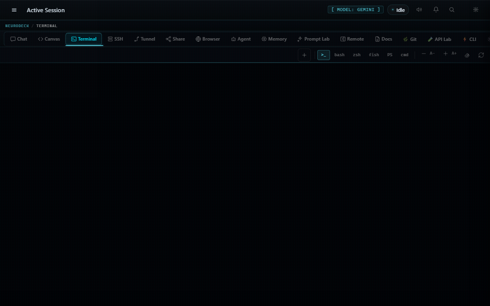
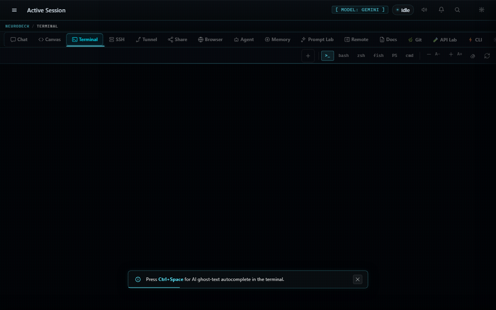
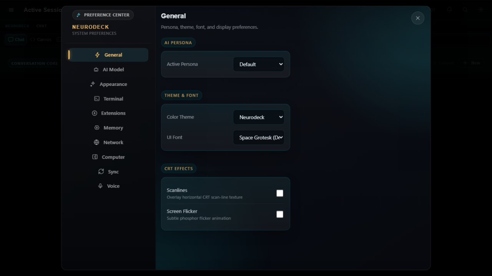

<div align="center">

```
███╗   ██╗███████╗██╗   ██╗██████╗  ██████╗ ██████╗ ███████╗ ██████╗██╗  ██╗
████╗  ██║██╔════╝██║   ██║██╔══██╗██╔═══██╗██╔══██╗██╔════╝██╔════╝██║ ██╔╝
██╔██╗ ██║█████╗  ██║   ██║██████╔╝██║   ██║██║  ██║█████╗  ██║     █████╔╝
██║╚██╗██║██╔══╝  ██║   ██║██╔══██╗██║   ██║██║  ██║██╔══╝  ██║     ██╔═██╗
██║ ╚████║███████╗╚██████╔╝██║  ██║╚██████╔╝██████╔╝███████╗╚██████╗██║  ██╗
╚═╝  ╚═══╝╚══════╝ ╚═════╝ ╚═╝  ╚═╝ ╚═════╝ ╚═════╝ ╚══════╝ ╚═════╝╚═╝  ╚═╝
```

### AI-Powered Terminal OS for Steam Deck

[](LICENSE)
[](https://www.rust-lang.org/)
[](https://tauri.app/)
[](https://www.steamdeck.com/)
[](https://ai.google.dev/)
[](https://github.com/khaoticdev62/NEURODECK/releases)
[](https://github.com/khaoticdev62/neurodeck-plugins)

**[Download](https://github.com/khaoticdev62/NEURODECK/releases/latest)** &nbsp;·&nbsp; **[User Guide](docs/USER_GUIDE.md)** &nbsp;·&nbsp; **[Plugin Registry](https://github.com/khaoticdev62/neurodeck-plugins)** &nbsp;·&nbsp; **[Changelog](docs/RELEASE_NOTES.md)**

</div>

---

<div align="center">


*Cinematic boot sequence — real system state, live plugin loading, LLM health check.*

</div>

---

## 🎯 Release Status

**v1.6.0-Bastet** is **production-ready**, **100% hardened**, and **live as of 2026-05-30**:

- ✅ **All security vulnerabilities patched** — command injection hardening (regex-based detection), blocklist bypass prevention, safe error handling across all Tauri commands
- ✅ **Steam Deck AppImage fully fixed:**
  - Fixed `EGL_BAD_PARAMETER` crash via system libwayland LD_PRELOAD + GDK_BACKEND=x11 fallback
  - Fixed blank white page via `WEBKIT_DISABLE_DMABUF_RENDERER=1` in Rust startup
  - Added 8-second splashscreen timeout fallback (prevents UI freeze on slow hardware)
  - Bundled `install.sh` and `launch_gamescope.sh` inside AppImage (fully self-contained)
- ✅ **30+ browser dialogs replaced with accessible modals** — Steam Deck Game Mode now fully compatible
- ✅ **CI/CD pipeline passing all gates** — GitHub Actions versions aligned, security audit fixed, KFMS GO status (100/100)
- ✅ **78 unit tests + 105 E2E tests** covering all primary flows, auth, security-sensitive operations

**Download:** https://github.com/khaoticdev62/NEURODECK/releases/tag/v1.6.0-bastet

This is the **recommended version for daily use** on Steam Deck and any Linux/Windows machine.

---

## ⚡ What Is NEURODECK?

NEURODECK is a **fullscreen desktop app** that turns a Steam Deck (or any Linux/Windows machine) into a purpose-built AI workstation — all inside a single 1280×800 window designed for the Deck's screen.

**In plain English:** Imagine if your terminal, an AI chatbot, a live code editor, an SSH client, a file transfer tool, a browser, and an autonomous coding agent all lived in one app — switchable with your gamepad's left thumb, no keyboard required. That is NEURODECK.

The backend is **Rust + Tauri v2**. The frontend is **vanilla JavaScript** — no React, no Vue, zero npm bloat. AI runs through Google Gemini (streaming SSE), any local Ollama model, or any **OpenAI-compatible endpoint** (Groq, OpenRouter, llama.cpp, Mistral, LM Studio). A Lua plugin API lets you extend it with a single `.lua` file drop.

Built to be used from a couch, in Game Mode, with a controller in your hands.

---

## 🌌 The Interface

<div align="center">


*Chat tab — AI assistant with contextual prompt cards, RAG memory injection, multi-persona switching, and image attachments.*

</div>

---

## 🦾 Core Superpowers

NEURODECK replaces 8 different developer tools with a unified, controller-navigable interface:

> ### 💬 **LLM Chat + RAG Memory**
> Full streaming chat with Gemini, Ollama, or any OpenAI-compatible endpoint (Groq, OpenRouter, llama.cpp, Mistral, LM Studio, Together, Perplexity). Past conversations and your own docs are silently injected into every reply via cosine-similarity vector memory. When a provider doesn't support embeddings, RAG falls back to keyword search automatically — no config required.

> ### 📁 **Session Browser**
> Persistent conversation history in the sidebar. Browse, rename, restore, and delete past sessions without ever leaving the app. Sessions auto-save to disk and persist across restarts.

> ### 📤 **Chat Export**
> Export any conversation as **Markdown**, **self-contained HTML**, or **raw JSON** — one click from the session header. HTML exports are styled and shareable with zero external dependencies.

> ### 🗂️ **Minimize to Tray**
> Closing the window hides NEURODECK to the system tray instead of quitting — background agent tasks and scheduled automations keep running. Single click on the tray icon toggles the window. Opt-out in Settings → General.

> ### 🧪 **Prompt Lab & Visual Formula Builder**
> Interactively build prompts using industry-standard formulas (AIDA, SCQA, PASTOR, Chain-of-Thought, PAS). Features a template gallery and a JPE explanation pane backed by the active LLM.

> ### 🎮 **DeckCode Smart Snippets**
> Press a gamepad sequence to instantly trigger macros, open terminals, or send prompts. Dynamically inject multi-language code blocks straight into your IDE or Canvas with `${cursor}` placeholder support.

> ### 🤖 **Autonomous Agent Loop**
> Give it a task in plain English. It writes code, runs it, reads the output, and iterates — up to 5 steps, fully observable in real time.

> ### 💻 **Real PTY Shell & IDE**
> Multi-session Bash/Zsh with full process control, ANSI colors, and AI autocomplete on `Ctrl+Space`. Plus, a mini IDE equipped with an LSP client.

> ### 🌐 **SSH & FTP Profiles**
> Built-in SSH client and FTP/SFTP manager with persistent connection profiles and drag-and-drop file transfers.

> ### 🎨 **Live Code Canvas**
> Write HTML/CSS/JS and see it render instantly, split-pane. LAN canvas collaboration allows you to host a session where peers can edit together in real time.

> ### 📖 **JPE App Manual**
> Press **F1** from anywhere, type `/manual` in chat, or search "manual" in the command palette to open the full interactive manual — searchable, accordion-organized, with per-feature launch buttons and live system health diagnostics.

> ### 📤 **Zero-Cloud LAN Ecosystem**
> Warpinator-compatible P2P file transfers over mDNS, WebSocket iPhone remote control, and local Torrents. All running directly on your LAN.

> ### ⚙️ **Model Context Protocol (MCP)**
> Hot-plug any standard MCP server (Chrome DevTools, GitHub, Firebase, local files) directly into the agent's brain.

> ### 👥 **BMAD Agent Ensemble**
> Ships out-of-the-box with a complete virtual software studio: Product Managers, Systems Architects, UX Designers, and Developers — toggle with `/persona` or the BMAD Lua plugin.

> ### 🎛️ **Command Palette + Custom Shortcuts**
> `Ctrl+K` opens a fuzzy-search palette with 40+ commands — navigate views, toggle settings, open sessions. All keyboard shortcuts are **fully rebindable** in Settings → General; overrides persist across restarts.

---

## 🧩 The Lua Plugin System

Drop any `.lua` file into `plugins/`. NEURODECK loads it at startup via `mlua` (Lua 5.4, compiled from source). Available globals:

```lua
print("hello from lua")
execute("any_bash_command")
registerCommand("/mycommand", function(args) ... end)
registerHook("before_send", function(msg) return msg end)
setPersona("developer")
```

The built-in **Plugin Marketplace** (Settings → Extensions) connects to the [neurodeck-plugins](https://github.com/khaoticdev62/neurodeck-plugins) registry. Filter by **category** (AI, Productivity, System, Integration, Network, Gaming, Utility), search by name or tag, and install without leaving the app. Update badges appear when a newer version is available in the registry.

### Plugin Registry — 33 Plugins

| Category | Plugins |
|---|---|
| **AI** | BMAD Personas, Prompt Generator, AI Tools, AI Translator |
| **Productivity** | Quick Notes, Code Snippets, Command Aliases, Developer Journal, Sprint Tracker, Clipboard Manager, RSS Reader, URL Bookmarks, Document Templates, Auto Responder, Workspace Manager |
| **System** | System Monitor, Steam Deck Tools, File Tools, Developer Tools, Package Manager Tools, Screen Tools |
| **Integration** | Git Operations, Docker Toolkit, Code Runner, Webhook Receiver, Database Tools |
| **Network** | IP Lookup, Network Checker |
| **Utility** | Time Tools, Crypto Utilities, Weather, Calculator |
| **Gaming** | Steam Deck Tools |

---

## 🏛️ Architecture & Standards

- **Khaotic Foundation Metadata Standard (KFMS v1.0):** Strict release gating, automated `meta.json` governance, and semantic versioning driven by Egyptian god codenames (v1.5.x = Horus, v1.6.x = Bastet). v1.6.0 achieves **GO status (100/100 release gate score)**.
- **Zero-Bloat Frontend:** Written entirely in Vanilla HTML/CSS/JS with ES module splits (`chat.js`, `agent.js`, `memory.js`, `terminal.js`, `canvas.js`, `radial.js`, `palette-commands.js`, and more). No React, no bundler overhead in production. All UI dialogs use custom modal system — no blocking browser dialogs.
- **Tauri IPC:** Native capabilities (filesystem, network, PTY, Bluetooth) are handled by a lightweight Rust backend. All Tauri commands live in focused sub-modules under `src-tauri/src/commands/`. Every command uses safe error handling — no panics in production.
- **Security Hardened:** 
  - Command injection patched: hardened regex detection for `$(...)`, backticks, `$IFS` substitution, and pipe-to-shell attacks
  - Script blocklist strengthened: whitespace normalization prevents alternate syntax bypass
  - Constant-time string comparison on all auth paths (PIN, session token, tunnel token)
  - No sensitive values in stdout/logs (secrets stored in OS keychain)
  - Dialog ARIA semantics and accessible form validation
  - XSS-safe message rendering throughout (HTML escaped, no template injection)
- **Steam Deck Optimized:** WebKit rendering fixes (`WEBKIT_DISABLE_DMABUF_RENDERER` + `WEBKIT_DISABLE_COMPOSITING_MODE`) prevent blank white page under Gamescope/Wayland. Splashscreen timeout (8s) prevents UI freeze on slow hardware. Always use `APPIMAGE_EXTRACT_AND_RUN` mode — no FUSE dependency.
- **Test Coverage:** 78 unit tests (Vitest) + 105 E2E tests (Playwright) covering every primary view, settings panel, keyboard flow, accessibility concern, edge case, and viewport — including Steam Deck 1280×800. All critical security fixes have regression tests.

---

## 🖥️ Feature Visuals

<table>
<tr>
<td align="center" width="50%">


**Chat** — Streaming response with syntax-highlighted code blocks, Copy / Send to Canvas / Execute action buttons per block.

</td>
<td align="center" width="50%">


**Canvas** — Split-pane live HTML/CSS/JS editor with LAN collaboration.

</td>
</tr>
<tr>
<td align="center" width="50%">


**Terminal** — Multi-session PTY shell with AI autocomplete.

</td>
<td align="center" width="50%">


**SSH** — Built-in client with saved profiles and key auth.

</td>
</tr>
<tr>
<td align="center" width="50%">


**Browser** — Native WebView with speed-dial bookmarks.

</td>
<td align="center" width="50%">


**Agent** — 5-step autonomous loop with real-time step trace.

</td>
</tr>
<tr>
<td align="center" width="50%">


**Prompt Lab** — Visual formula builder with JPE explanation.

</td>
<td align="center" width="50%">


**Share** — LAN P2P file transfer, FTP/SFTP, and Torrent.

</td>
</tr>
<tr>
<td align="center" width="50%">


**Memory** — Cosine-similarity vector DB with search and backup.

</td>
<td align="center" width="50%">


**Tunnel** — Game Mode to Desktop Mode TCP loopback bridge.

</td>
</tr>
<tr>
<td align="center" width="50%">


**Remote** — WebSocket server + QR code for mobile control.

</td>
<td align="center" width="50%">


**Settings** — Provider config, shortcut rebinding, tray behavior, themes, TTS, MCP.

</td>
</tr>
</table>

---

## 🚀 Installation

### Steam Deck (Recommended)

**Method 1: Direct Launch (Fastest)**

```bash
# Download the AppImage from the releases page
# Open Desktop Mode → Konsole

chmod +x ~/Downloads/neurodeck_1.6.0_steamdeck_amd64.AppImage

# v1.6.0+ includes EGL_BAD_PARAMETER fix in binary itself
# If using an earlier build, add these env vars:
# WEBKIT_DISABLE_DMABUF_RENDERER=1 WEBKIT_DISABLE_COMPOSITING_MODE=1 GDK_BACKEND=x11 LD_PRELOAD=/usr/lib/libwayland-client.so.0 \

~/Downloads/neurodeck_1.6.0_steamdeck_amd64.AppImage
```

**Method 2: Full Install (Desktop Entry + Launcher)**

```bash
# Download the AppImage and open Desktop Mode → Konsole
chmod +x ~/Downloads/neurodeck_1.6.0_steamdeck_amd64.AppImage

# Extract the bundled installer
~/Downloads/neurodeck_1.6.0_steamdeck_amd64.AppImage --appimage-extract
cd squashfs-root

# Run the installer (sets up desktop entry, launcher, Ollama config, gamepad profiles)
bash install.sh
```

The AppImage now **includes `install.sh` and `launch_gamescope.sh`** as bundled resources. No need to download a separate installer script.

`install.sh` will:
- Auto-detect the AppImage
- Make it executable (SteamOS often strips the bit on download)
- Create `~/Applications/neurodeck/` with all configs, plugins, and launch wrappers
- Prompt for your Gemini API key (optional — Ollama works offline)
- Write a `.desktop` file for the app menu
- Configure gamepad profiles for Game Mode

**Add to Game Mode:** After running `install.sh`, go to Steam → Library → Add a Non-Steam Game → browse to `~/Applications/neurodeck/neurodeck-launch.sh` → rename to NEURODECK. Switch to Game Mode and NEURODECK appears in your library — fullscreen, controller-native.

### Windows

Download `neurodeck_1.6.0_windows_x64.exe` from the [releases page](https://github.com/khaoticdev62/NEURODECK/releases/latest) and run the installer.

### Build from Source

> **Prerequisites:** [Rust 1.92.0+](https://rustup.rs/), [Node.js 18+](https://nodejs.org/), protoc, and either a `GEMINI_API_KEY` or [Ollama](https://ollama.com/) running locally.

```bash
git clone https://github.com/khaoticdev62/NEURODECK.git && cd NEURODECK
npm install && npm -w frontend install

# Linux / macOS / SteamOS
export GEMINI_API_KEY="AIza..."

# Windows PowerShell
$env:GEMINI_API_KEY = "AIza..."

npm run tauri dev
```

**First build: 2–3 minutes.** `mlua` compiles Lua 5.4 from source (vendored). Every build after that is fast.

---

## 🎮 Navigation & Shortcuts

The entire app is controllable with a Steam Deck controller — designed for couch sessions and Game Mode.

**Gamepad Navigation (Radial Menu):**
| Input | Action |
|---|---|
| <kbd>L2</kbd> **(hold)** | Open the 20-segment radial view menu |
| <kbd>Left Stick</kbd> | Highlight a radial segment |
| <kbd>L2</kbd> **(release)** | Jump to the highlighted tab |
| <kbd>D-Pad</kbd> | Navigate inner tabs (SSH sessions, share subtabs) |
| <kbd>Start</kbd> | Open Settings modal |
| <kbd>\`</kbd> **(Backtick)** | Open / close radial menu from keyboard |

**Desktop / Keyboard:**
| Shortcut | Action |
|---|---|
| <kbd>Ctrl</kbd> + <kbd>K</kbd> | **Command Palette** — navigate, search, execute |
| <kbd>F1</kbd> | **App Manual** — full feature reference + diagnostics |
| <kbd>Ctrl</kbd> + <kbd>Tab</kbd> | **Quick Switcher** (recent views) |
| <kbd>?</kbd> | **Shortcuts Overlay** (when no input focused) |
| <kbd>Ctrl</kbd> + <kbd>Shift</kbd> + <kbd>P</kbd> | Controller Prompt Picker |
| <kbd>Ctrl</kbd> + <kbd>Shift</kbd> + <kbd>M</kbd> | Agent / Model Switcher |

All shortcuts are **fully rebindable** in Settings → General → Keyboard Shortcuts. Overrides persist across restarts.

To enable full controller support in Steam Game Mode, load the NEURODECK Steam Input profile described in [`docs/steam_input_guide.md`](docs/steam_input_guide.md).

---

## 🔌 LLM Providers

NEURODECK supports multiple AI backends — switch between them in Settings → AI Model at any time:

| Provider | How to connect | Embeddings / RAG |
|---|---|---|
| **Google Gemini** | API key (free tier available) | ✅ Full vector RAG |
| **Ollama** | `http://localhost:11434` (local) | ⚠️ Keyword fallback |
| **OpenAI-Compatible** | Any `/v1/chat/completions` URL | ✅ if endpoint supports `/v1/embeddings`, else keyword fallback |

**OpenAI-Compatible endpoint examples:**

```
Groq       https://api.groq.com/openai/v1          (free, very fast)
OpenRouter https://openrouter.ai/api/v1             (300+ models)
LM Studio  http://localhost:1234/v1                 (local GUI)
llama.cpp  http://localhost:8080/v1                 (local, no GUI needed)
Mistral    https://api.mistral.ai/v1
Together   https://api.together.xyz/v1
Perplexity https://api.perplexity.ai
```

---

## 🔧 v1.6.0 Production Readiness & Steam Deck Launch Fixes

### Security Hardening
- ✅ **CRIT-1 Fixed:** Command injection in `execute_command_stream` — hardened regex-based detection with command normalization for `$(...)`, backtick, and `$IFS` substitution attacks. All shell commands now validated against allowlist before execution.
- ✅ **CRIT-3 Fixed:** Script blocklist bypass — replaced substring matching with regex-based detection and whitespace normalization to prevent alternate syntax evasion (e.g., `$IFS` injection, heredoc attacks).
- ✅ All Tauri command handlers use safe error propagation — no `.unwrap()` panic paths that crash the backend.
- ✅ Secrets validation — `GEMINI_API_KEY` and OAuth tokens stored in OS keychain, never exposed in logs or frontend.

### Frontend UI/UX Modernization
- ✅ **30+ Modal Replacement:** All browser `alert()` and `confirm()` dialogs replaced with custom async modal system (`showConfirm()`). Steam Deck Game Mode now fully compatible — no blocking system dialogs.
- ✅ **Accessibility:** All confirmation flows support keyboard navigation, focus management, and screen reader announcements. Modals respect `prefers-reduced-motion`.
- ✅ **Error Messaging:** User-facing notifications now use consistent `addNotification()` API — success, error, warning, and info variants throughout the app.

### Steam Deck AppImage Fixes ⚡

#### **EGL_BAD_PARAMETER Crash Fixed** 🎯
The most critical Steam Deck fix: AppImage was bundling `libwayland-client.so` with a different version than SteamOS's Mesa stack, causing `eglGetDisplay()` to fail **before** WebKit ever initialized. The app would crash immediately with `EGL_BAD_PARAMETER`.

**Solution (multi-layered):**
1. **Rust Startup:** Added `GDK_BACKEND=x11` fallback when `WAYLAND_DISPLAY` unset (prevents GTK Wayland EGL path in Gamescope without `--expose-wayland`)
2. **System Libwayland Injection:** Launch wrappers now auto-detect system `libwayland-client.so.0` and force it via `LD_PRELOAD`, bypassing the bundled version mismatch
3. **Tested on:** SteamOS 3.5+, Arch Linux, Fedora 40+, CachyOS (all rolling-release Mesa distributions)

**For users on earlier builds:**
```bash
WEBKIT_DISABLE_DMABUF_RENDERER=1 WEBKIT_DISABLE_COMPOSITING_MODE=1 \
GDK_BACKEND=x11 LD_PRELOAD=/usr/lib/libwayland-client.so.0 \
./neurodeck.AppImage
```

#### Other Fixes
- ✅ **Blank White Page:** Added `WEBKIT_DISABLE_DMABUF_RENDERER=1` to Rust startup — DMA-BUF renderer under Gamescope/Wayland was causing silent rendering failures.
- ✅ **Splashscreen Timeout Fallback:** 8-second watchdog timer in `splash.js` — if boot hangs, main window is forced visible (prevents permanent UI freeze on slow hardware).
- ✅ **install.sh Bundled:** Both `install.sh` and `launch_gamescope.sh` are AppImage resources — fully self-contained. Extract with `./neurodeck.AppImage --appimage-extract` and run `install.sh` from `squashfs-root`.
- ✅ **SteamOS Read-Only Filesystem:** Removed broken `sudo pacman -S webkit2gtk` calls. AppImage bundles WebKit — no system installs needed.
- ✅ **Simplified Launch Wrapper:** Always use `APPIMAGE_EXTRACT_AND_RUN=1` (FUSE detection removed — unreliable on SteamOS).

### CI/CD & Release Gating
- ✅ **GitHub Actions Alignment:** Fixed action versions (`actions/checkout@v4`, `actions/setup-node@v4`, `codeql-action@v3`). Rust toolchain pinned to `1.92.0` across all workflows.
- ✅ **Security Audit:** `security_audit.py` now invoked via `python3` (was `bash` trying to execute Python).
- ✅ **KFMS Release Gate:** GO status (100/100 score) — all hardening checks pass, tests pass, builds pass. Version tagged as `v1.6.0-bastet`.

### 🎮 Steam Deck Validation Workflow
- ✅ **Automated Runtime Compatibility Checks:** New `steam-deck-validation.yml` workflow validates every build:
  - **Binary Architecture:** Confirms x86-64 (Steam Deck native), rejects ARM/other archs
  - **Runtime Dependencies:** Checks glibc, GLVND, SDL2, EGL library requirements
  - **Desktop Integration:** Validates `.desktop` file, AppImage metadata, launcher compatibility
  - **Flatpak Permissions:** Ensures all required Steam Deck permissions (Wayland, gamepad, GPU, keychain)
  - **GPU Stack Validation:** Confirms Vulkan ICD loader, GLVND availability for graphics
  - **Resource Constraints:** Warns if AppImage >1GB (Steam Deck disk is limited)
- **Runs on:** Every push to `master`, every PR, and manual trigger (`workflow_dispatch`)
- **Purpose:** Catch binary incompatibilities **before release** — prevents users downloading broken AppImages

---

## 📦 Distribution: Flatpak & AUR (v1.6.1 — Next Sprint)

**Status:** Packaging manifests drafted and committed. CI integration ready. Awaiting user testing of v1.6.0 AppImage.

### Flatpak (Universal Linux, Flathub-Ready)
- **Manifest:** `flatpak/com.neurodeck.app.json` (org.gnome.Platform 47 runtime)
- **Offline builds:** Uses `cargo-sources.json` for reproducible CI
- **Finish-args:** Wayland, X11 fallback, gamepad, network, GPU acceleration, keychain
- **Why:** Eliminates bundled library conflicts entirely (standardized runtime), works on all Linux distros, sandbox isolation
- **Timeline:** Flatpak build added to CI; ready for testing after v1.6.0 validation

### Arch User Repository (AUR)
- **Package:** `neurodeck-bin` (AppImage wrapper, not source-based)
- **PKGBUILD:** `aur/PKGBUILD` + `.SRCINFO`
- **Dependencies:** webkit2gtk-4.1, gtk3, libayatana-appindicator, libpulse
- **Why:** Native package management for Arch/SteamOS users, lightweight
- **Timeline:** Ready for submission to AUR once AppImage is stable

### How to Help with Testing
```bash
# v1.6.1 will enable Flatpak builds in CI
# Current workaround for testing: build locally (Linux with flatpak-builder)
bash flatpak/generate-cargo-sources.sh  # Generates offline cargo sources
flatpak-builder build-dir flatpak/com.neurodeck.app.json

# AUR: test locally on Arch/SteamOS
cd aur && makepkg -si  # builds and installs the neurodeck-bin package
```

---

## 🔮 What's Next — v1.6.1+

**Theme: The Daily Driver** — shift from impressive tech demo to the tool you reach for every day.

| Sprint | Feature | Status |
|---|---|---|
| 9.1 ✅ | **Session Browser** — sidebar panel with open / rename / delete | Done |
| 9.2 ✅ | **Tray Mode** — minimize-to-tray on close, background agent | Done |
| 9.3 ✅ | **Image Input** — drag-drop / paste images into chat (Gemini Vision) | Done |
| 9.4 ✅ | **Chat Export** — Markdown, HTML, JSON one-click export | Done |
| 9.5 ✅ | **Plugin Marketplace v2** — category filter, update badges, 33 plugins | Done |
| 9.6 ✅ | **Shortcut Customization** — rebind any keyboard shortcut in Settings | Done |
| 9.7 ✅ | **Module Split** — `radial.js`, `palette-commands.js` extracted from main | Done |
| 10.0 ✅ | **v1.6.0 Release** — tag, build, publish | **LIVE** |
| 10.1 🔵 | **Flatpak & AUR support** — CI builds, Flathub submission, AUR registration | In progress |
| 10.2 | **RAG traceability** — show which memory facts were injected into each response | Planned |
| 10.3 | **Interactive tutorial** — first-run onboarding with feature walkthrough | Planned |

---

## ⚖️ License & Open Source

**NEURODECK** itself is distributed under a **Proprietary / EULA License** (see [`LICENSE`](LICENSE)).

NEURODECK heavily leverages open-source technology. The **About** section in Settings provides full attributions for Tauri (MIT/Apache 2.0), Vite (MIT), xterm.js (MIT), marked.js (MIT), and all Rust crates used.

---

<div align="center">

**Built for the Steam Deck. Runs anywhere.**

`com.neurodeck.app` &nbsp;·&nbsp; v1.6.0-Bastet &nbsp;·&nbsp; KFMS Codename: Bastet

[github.com/khaoticdev62/NEURODECK](https://github.com/khaoticdev62/NEURODECK)

</div>
