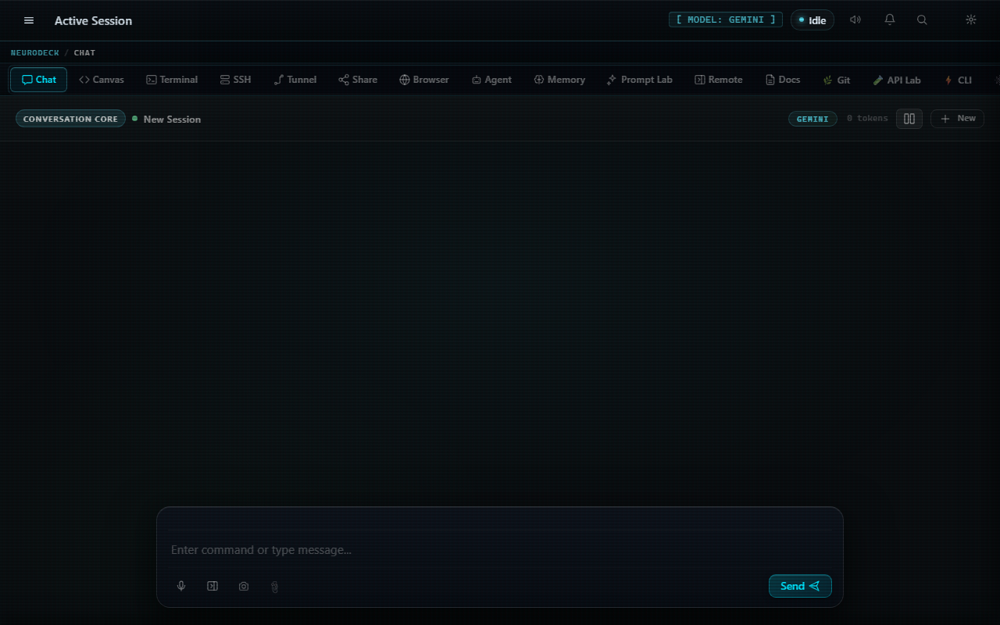
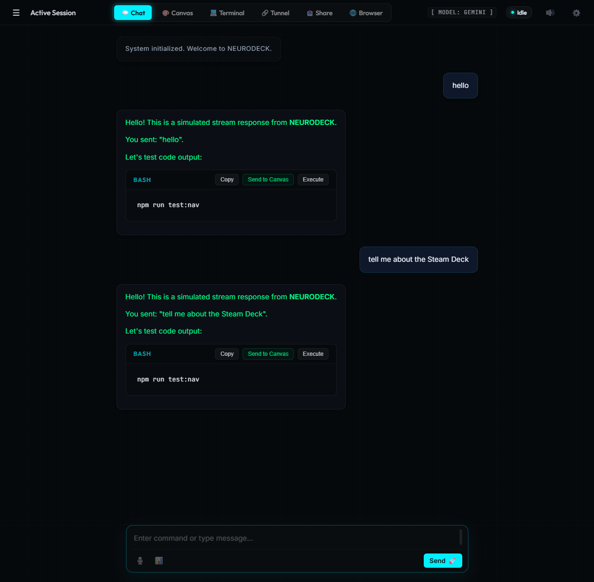
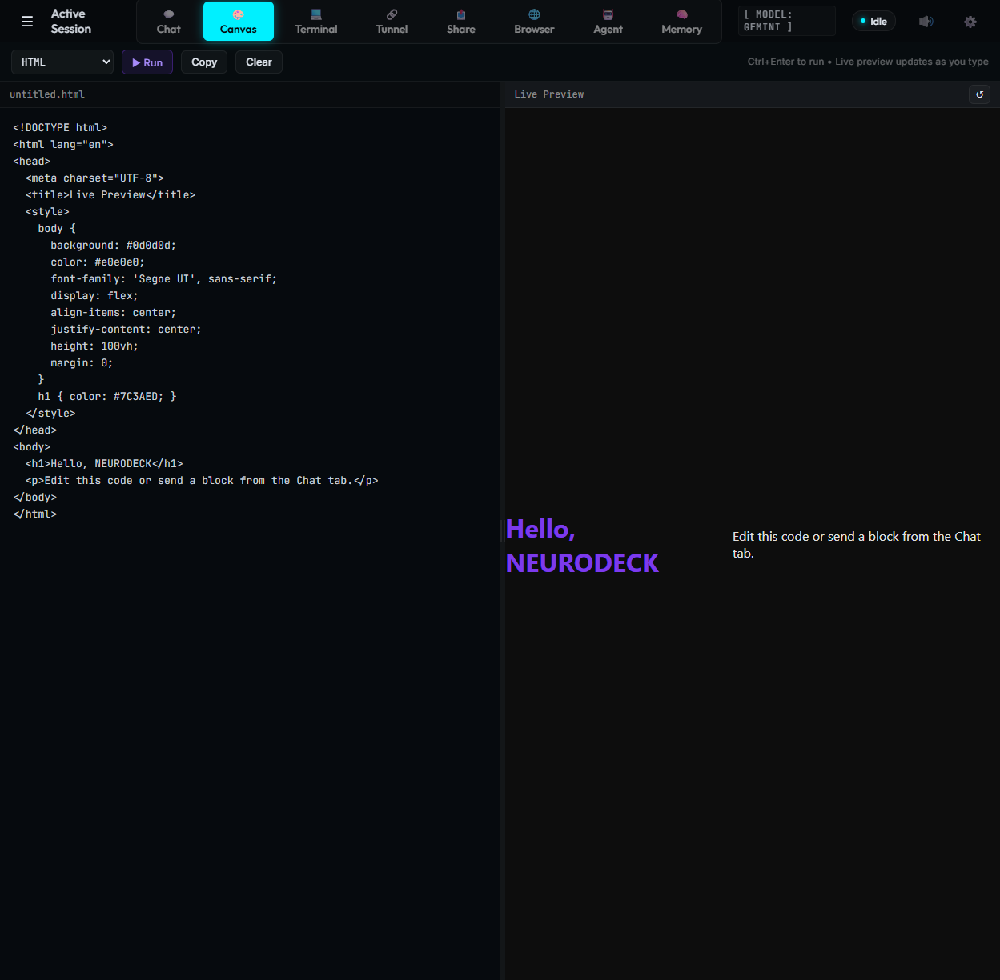
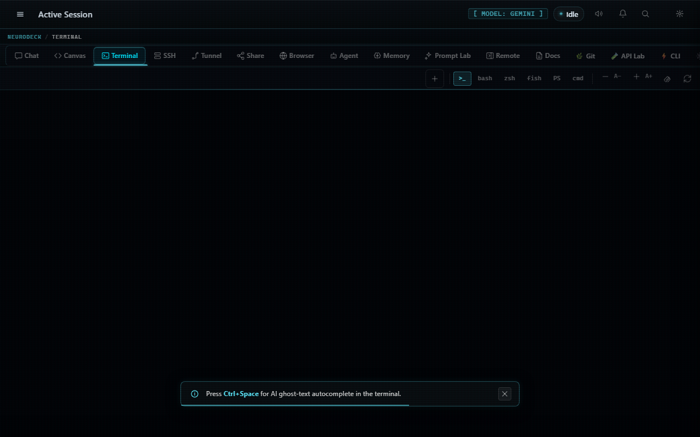
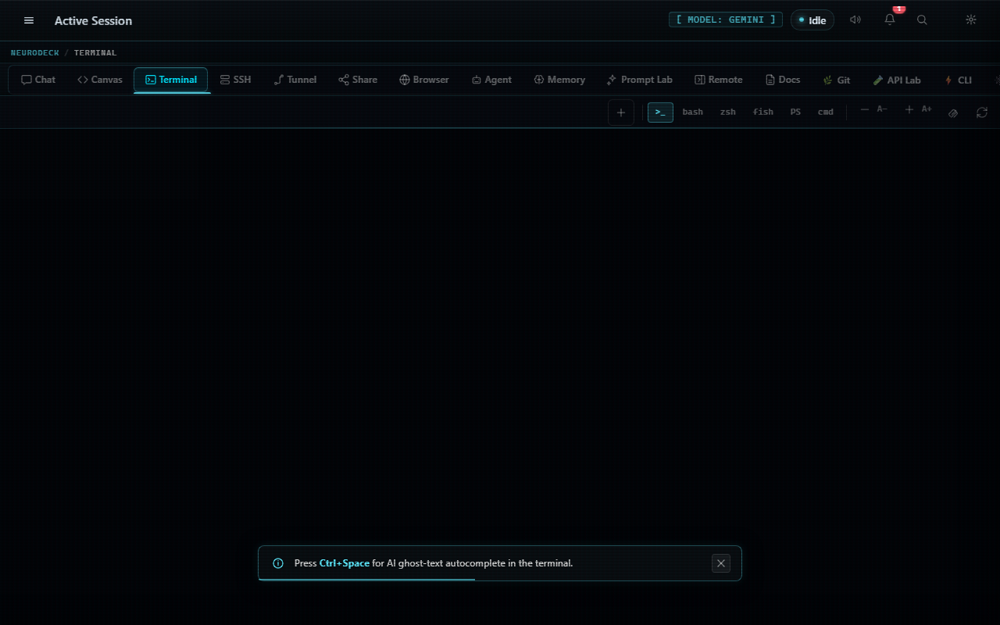
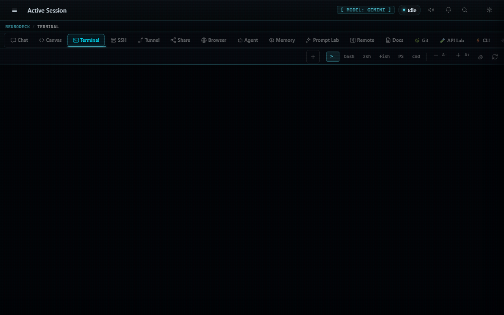
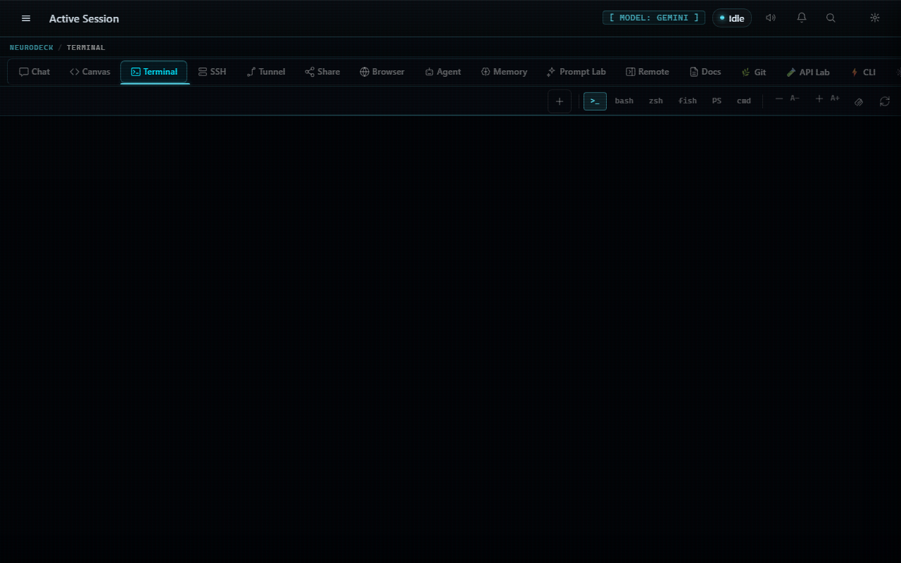
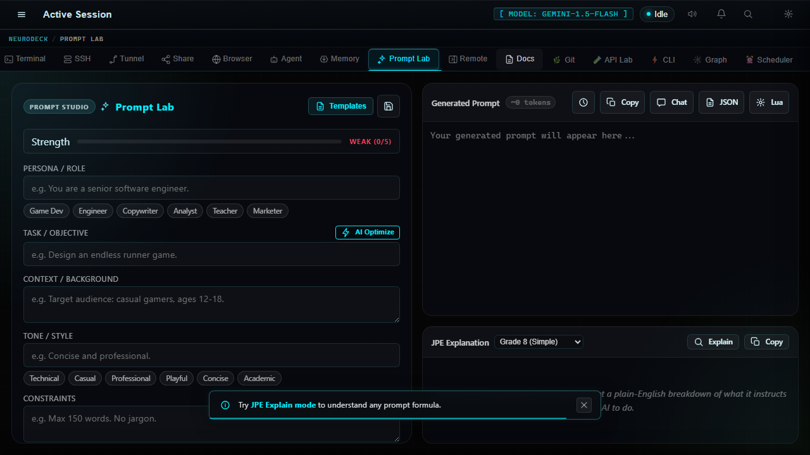
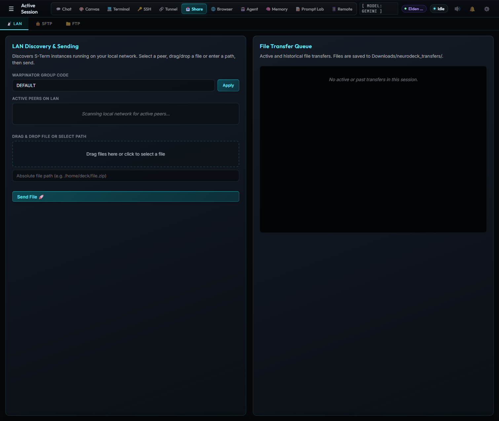

<div align="center">

```
███╗   ██╗███████╗██╗   ██╗██████╗  ██████╗ ██████╗ ███████╗ ██████╗██╗  ██╗
████╗  ██║██╔════╝██║   ██║██╔══██╗██╔═══██╗██╔══██╗██╔════╝██╔════╝██║ ██╔╝
██╔██╗ ██║█████╗  ██║   ██║██████╔╝██║   ██║██║  ██║█████╗  ██║     █████╔╝
██║╚██╗██║██╔══╝  ██║   ██║██╔══██╗██║   ██║██║  ██║██╔══╝  ██║     ██╔═██╗
██║ ╚████║███████╗╚██████╔╝██║  ██║╚██████╔╝██████╔╝███████╗╚██████╗██║  ██╗
╚═╝  ╚═══╝╚══════╝ ╚═════╝ ╚═╝  ╚═╝ ╚═════╝ ╚═════╝ ╚══════╝ ╚═════╝╚═╝  ╚═╝
```

### AI-Powered Terminal OS for Steam Deck

[](LICENSE)
[](https://www.rust-lang.org/)
[](https://tauri.app/)
[](https://www.steamdeck.com/)
[](https://ai.google.dev/)
[](https://github.com/khaoticdev62/NEURODECK/releases)

**[Download](https://github.com/khaoticdev62/NEURODECK/releases)** &nbsp;·&nbsp; **[User Guide](docs/USER_GUIDE.md)** &nbsp;·&nbsp; **[Plugin Registry](https://github.com/khaoticdev62/neurodeck-plugins)** &nbsp;·&nbsp; **[Roadmap](docs/ANTIGRAVITY_HANDOFF.md)**

</div>

---

<div align="center">



*Cinematic boot sequence — real system state, live plugin loading, LLM health check.*

</div>

---

## What Is NEURODECK?

NEURODECK is a **fullscreen desktop app** that turns a Steam Deck (or any Linux/Windows machine) into a purpose-built AI workstation — all inside a single 1280×800 window designed for the Deck's screen.

**In plain English:** Imagine if your terminal, an AI chatbot, a live code editor, an SSH client, a file transfer tool, a browser, and an autonomous coding agent all lived in one app — switchable with your gamepad's left thumb, no keyboard required. That is NEURODECK.

The backend is **Rust + Tauri v2**. The frontend is **vanilla JavaScript** — no React, no Vue, zero npm bloat. AI runs through Google Gemini (streaming SSE) or any local Ollama model. A Lua plugin API lets you extend it with a single `.lua` file drop. Everything is wired through a clean, typed IPC bridge.

Built to be used from a couch, in Game Mode, with a controller in your hands.

---

## The Interface

<div align="center">


*Chat tab — AI assistant with contextual prompt cards, RAG memory injection, and multi-persona switching.*

</div>

---

## What It Can Do

| Capability | What That Means |
|---|---|
| 💬 **LLM Chat + RAG Memory** | Full streaming chat with Gemini or Ollama. Past conversations and your own docs are silently injected into every reply — no copy-paste, no re-explaining. |
| 🤖 **Autonomous Agent Loop** | Give it a task in plain English. It writes code, runs it, reads the output, and iterates — up to 5 steps, fully observable in real time. |
| 💻 **Real PTY Shell** | Not a fake terminal. Multi-session Bash/Zsh with full process control, ANSI colors, and AI autocomplete on `Ctrl+Space`. |
| 🎨 **Live Code Canvas** | Write HTML/CSS/JS and see it render instantly, split-pane. LAN canvas collaboration — host binds a port, a peer joins and you edit together. |
| 🔑 **Built-in SSH Client** | Connect to remote servers directly from the app. Password or key auth. Each session is an isolated PTY. |
| 🌐 **Embedded Browser** | WebView panel with speed-dial bookmarks and URL bar — doc lookups without leaving the app. |
| 🧠 **Prompt Lab** | Visual prompt engineering studio. Pick a formula (AIDA, SCQA, CoT, ToT), fill the form, get a precision-crafted prompt. JPE explanation included. |
| 📤 **LAN File Transfer** | Send files to nearby devices via mDNS peer discovery and Warpinator gRPC — no cloud, no setup, no account. |
| 📱 **iPhone Remote** | Start a WebSocket server, scan the QR code, control NEURODECK from Safari on your phone. |
| 🎮 **Gamepad-Native UI** | Hold L2, use the left stick to pick a tab, release. Entire app navigable with zero keyboard. |
| 🔌 **Lua Plugin API** | Drop a `.lua` file in `plugins/` — it auto-loads at startup. Register commands, hooks, and custom personas. |
| 🏪 **Plugin Marketplace** | Browse, search, and install community plugins from the built-in registry at `github.com/khaoticdev62/neurodeck-plugins`. |

---

## Screenshots

<table>
<tr>
<td align="center" width="50%">


**Chat** — Streaming response with syntax-highlighted code blocks, Copy / Send to Canvas / Execute action buttons per block.

</td>
<td align="center" width="50%">


**Canvas** — Split-pane live HTML/CSS/JS editor. Code left, rendered preview right. Ctrl+Enter to run.

</td>
</tr>
<tr>
<td align="center" width="50%">


**Terminal** — Multi-session PTY shell. Ctrl+Space for AI autocomplete. Ctrl+H for AI history search.

</td>
<td align="center" width="50%">


**SSH** — Built-in client with saved profiles. Password or key auth. ConnectTimeout guard prevents UI hangs.

</td>
</tr>
<tr>
<td align="center" width="50%">


**Browser** — Native WebView overlay with speed-dial bookmarks. DuckDuckGo, Wikipedia, HN, r/SteamDeck, CodePen and more pre-loaded.

</td>
<td align="center" width="50%">


**Agent** — 5-step autonomous loop: Plan → Write → Execute → Observe → Iterate. Every step streamed live. Roundtable mode for multi-step debates.

</td>
</tr>
<tr>
<td align="center" width="50%">


**Prompt Lab** — Visual formula builder. AIDA, SCQA, PASTOR, CoT, ToT, PAS, Role+Constraints. JPE Explain button breaks down what the AI will do.

</td>
<td align="center" width="50%">


**Share** — LAN P2P file transfer via mDNS. Warpinator gRPC (Linux-compatible). FTP/SFTP browser all in one panel.

</td>
</tr>
<tr>
<td align="center" width="50%">


**Remote** — WebSocket server + QR code. Scan with iPhone Camera → Safari webapp opens instantly. Pure LAN, zero cloud.

</td>
</tr>
</table>

---

## Quick Start

> **Prerequisites:** [Rust 1.77.2+](https://rustup.rs/), [Node.js 18+](https://nodejs.org/), and either a `GEMINI_API_KEY` set or [Ollama](https://ollama.com/) running locally.

```bash
git clone https://github.com/khaoticdev62/NEURODECK.git && cd NEURODECK
npm install --prefix frontend

# Linux / macOS / SteamOS
export GEMINI_API_KEY="AIza..."

# Windows PowerShell
$env:GEMINI_API_KEY = "AIza..."

npm run tauri dev
```

**First build: 2–3 minutes.** `mlua` compiles Lua 5.4 from source (vendored). Every build after that is fast.

---

## Steam Deck Game Mode

NEURODECK ships full custom artwork for the Steam library and Game Mode. All assets use the NEURODECK brand: dark `#050505` background, `#00F0FF` cyan circuit-N monogram, `#00CC88` teal accents.

### Steam Grid Assets

| File | Dimensions | Purpose |
|---|---|---|
| `assets/steam-grid/hero.png` | 1920×620 | Game detail hero banner |
| `assets/steam-grid/capsule-portrait.png` | 600×900 | Portrait capsule (shelf view) |
| `assets/steam-grid/capsule-landscape.png` | 920×430 | Landscape capsule |
| `assets/steam-grid/logo.png` | 600×200 | Library logo (transparent bg) |
| `src-tauri/icons/icon.png` | 512×512 | Linux `.desktop` app icon |
| `src-tauri/icons/icon.ico` | multi-res (16–256px) | Windows app icon |

See [`assets/steam-grid/README.md`](assets/steam-grid/README.md) for step-by-step Steam library installation instructions. To regenerate all brand assets from source:

```bash
python assets/brand/generate_assets.py
```

### Install to Steam Deck

```bash
# 1. Deploy to ~/Applications/neurodeck/
chmod +x install.sh && ./install.sh

# 2. Add as non-Steam game in Steam Desktop Mode
#    Then copy Steam grid assets:
GRID=~/.local/share/Steam/userdata/{userId}/config/grid
cp assets/steam-grid/hero.png              "$GRID/{appid}_hero.png"
cp assets/steam-grid/capsule-landscape.png "$GRID/{appid}.png"
cp assets/steam-grid/capsule-portrait.png  "$GRID/{appid}p.png"
cp assets/steam-grid/logo.png              "$GRID/{appid}_logo.png"

# 3. Launch in Game Mode via gamescope (1280×800, fullscreen)
./launch_gamescope.sh
```

---

## All 12 Tabs — What Each One Does

Switch tabs with the radial menu (`` ` `` backtick or gamepad **L2**), or click the tab bar.

| # | Tab | What It Does |
|---|---|---|
| 1 | 💬 **Chat** | Streaming AI chat with Gemini or Ollama. RAG memory auto-injects top-3 relevant past messages and indexed docs before every reply. Game context is automatically added when a Steam game is detected. Switch personas with `/john`, `/sally`, `/developer`, etc. |
| 2 | 🎨 **Canvas** | Live HTML/CSS/JS sandbox with instant split-pane preview. Python, Bash, and Lua execution also supported. LAN canvas collaboration — host binds a port, peer connects, edits sync in real time via TCP. |
| 3 | 💻 **Terminal** | Full PTY shell, multi-session. `Ctrl+Space` → AI autocomplete of your partial command. `Ctrl+H` → AI-powered shell history search. Full ANSI, process signals, the works. |
| 4 | 🔑 **SSH** | Built-in SSH client. Password or key-based auth. Saved connection profiles. Each session is its own PTY with a `ConnectTimeout=30` guard. |
| 5 | 🔗 **Tunnel** | TCP loopback bridge between SteamOS Game Mode and Desktop Mode. Lets apps communicate across the OS boundary that Steam enforces. |
| 6 | 🌐 **Browser** | Embedded WebView with speed-dial bookmarks, URL bar, back/forward, and keyboard shortcuts. Opens as a native overlay window positioned inside the main app frame. |
| 7 | 🤖 **Agent** | Autonomous 5-step loop: Plan → Write → Execute → Observe → Iterate. Also has a Roundtable mode for multi-agent debate chains. Every step is streamed live — nothing hidden. |
| 8 | 🧠 **Memory** | Browse and query the local cosine-similarity vector database. Index your own `.txt`, `.md`, and code file folders. Query it manually. See exactly what context the AI is pulling. |
| 9 | 📤 **Share** | LAN P2P file transfer via mDNS peer discovery + Warpinator gRPC. Also a full FTP and SFTP file browser. No cloud account. No setup. |
| 10 | 🔬 **Prompt Lab** | Visual prompt engineering studio. 7 formula templates (AIDA, SCQA, PASTOR, CoT, ToT, PAS, Role+Constraints). A template gallery. JPE Explain mode that describes exactly what the AI will do with your prompt before you send it. |
| 11 | 📱 **Remote** | axum WebSocket server on a local port. A QR code appears — scan with iPhone. A Safari webapp opens with live terminal output and full command input. Zero install, zero cloud. |
| 12 | ⚙️ **Settings** | Theme switcher (7 built-in + custom hex), LLM provider/model config, API key management via OS keychain, persona selector, and onboarding diagnostics. |

---

## How It Works — Under the Hood

> Skip this section if you just want to use the app. Read it if you want to contribute or extend NEURODECK.

### The Two Processes

NEURODECK is two processes talking through [Tauri v2 IPC](https://tauri.app/):

```
┌─────────────────────────────────────────────────────────────┐
│  FRONTEND  (WebView — Chromium engine)                      │
│                                                             │
│  frontend/src/main.js      ~8,200 lines — HTML templates,  │
│                            view routing, IPC wiring, radial │
│                            menu, boot sequence, onboarding  │
│  frontend/src/chat.js      send flow, RAG, streaming,       │
│                            history, persona/theme switching  │
│  frontend/src/agent.js     agent loop, roundtable,          │
│                            computer/browser tool dispatch    │
│  frontend/src/canvas.js    Monaco editor, live preview,     │
│                            collab host/join/stop             │
│  frontend/src/terminal.js  xterm.js, multi-session PTY,     │
│                            SSH tab wiring                    │
│  frontend/src/memory.js    memory list, filter, pin, delete │
│  frontend/src/notifications.js  toast stack, badge mgmt     │
│  frontend/src/state.js     shared mutable state singleton   │
│  frontend/src/icons.js     Lucide SVG icon factory          │
│                                                             │
│  invoke("command", { args })  ──────────────────────────►  │
│  listen("event", handler)     ◄────────────────────────── │
└─────────────────────────────────────────────────────────────┘
                          Tauri v2 IPC Bridge
┌─────────────────────────────────────────────────────────────┐
│  BACKEND  (Rust / Tauri v2)                                 │
│                                                             │
│  src-tauri/src/lib.rs       ~1,600 lines — all commands,   │
│                             AppState, themes, personas,     │
│                             game detection, voice I/O       │
│  ├── llm.rs                 Gemini SSE + Ollama streaming  │
│  ├── pty_manager.rs         PTY sessions (portable-pty)    │
│  ├── memory.rs              Cosine-similarity vector DB    │
│  ├── ftp.rs / sftp.rs       FTP + SFTP clients            │
│  ├── transfer.rs            LAN P2P + Warpinator gRPC      │
│  ├── canvas_collab.rs       TCP live canvas sync           │
│  ├── sync.rs                Cross-device encrypted sync    │
│  ├── lua.rs                 mlua 5.4 plugin runtime        │
│  ├── tunnel.rs              Game Mode TCP bridge           │
│  └── commands/              session, config, system,       │
│                             agent, browser sub-modules      │
└─────────────────────────────────────────────────────────────┘
```

**Request/response** (load settings, get themes, etc.) → `invoke()` returns a value.  
**Streaming** (LLM tokens, PTY output, agent steps) → backend `emit()` → frontend `listen()` receives chunks in real time.

### Infrastructure Crate

A separate Rust workspace crate (`neurodeck_infrastructure`) handles platform services:

| Module | Plain English |
|---|---|
| `secrets.rs` | Reads/writes your API key from the **OS keychain** — Windows Credential Manager, Linux Secret Service, macOS Keychain. Never stored in a plaintext file. |
| `oauth.rs` | Google OAuth2 **Device Flow** — shows a short code you enter at `google.com/device`. Works without a browser. |
| `warpinator.rs` | Full **gRPC server** (tonic) implementing the Warpinator file-transfer protocol — compatible with the Linux Warpinator desktop app. |

---

## How the AI Memory Works

> One read, understand it forever.

When you send a message in Chat, NEURODECK silently does three things:

1. **Converts your message into a vector** — a 768-number mathematical fingerprint of what your message *means*, not just the words it uses.
2. **Compares that fingerprint** against every past message and indexed document in the local DB using cosine similarity: "how close in meaning are these two things on a scale of 0 to 1?"
3. **Prepends the top-3 closest matches** to the AI's context before your message is sent. The AI sees your message with relevant context already attached.

This is called **RAG — Retrieval-Augmented Generation.** It means the AI recalls conversations from weeks ago without you repeating yourself, and can reference your own documents as if it read them.

The DB lives in `data/memory/chat_history.json`. Point NEURODECK at any folder of `.txt`, `.md`, or code files in the Memory tab to index your own docs the same way.

> **Requires Gemini API** — `generate_embedding()` calls the Gemini embedding endpoint. If Ollama is the active provider, RAG is silently skipped for that session.

---

## Gamepad Navigation

The entire app is controllable with a Steam Deck controller — designed for couch sessions and Game Mode.

| Input | Action |
|---|---|
| **L2 (hold)** | Open the 12-segment radial menu |
| **Left Stick** | Highlight a radial segment (tab) |
| **L2 (release)** | Jump to the highlighted tab |
| **D-Pad** | Navigate inner tabs (e.g., multiple SSH sessions) |
| `` ` `` **Backtick** | Open / close radial menu from keyboard |
| **Arrow Keys** (radial open) | Highlight segments |
| **Enter** (radial open) | Activate highlighted segment |

To enable full controller support in Steam Game Mode, load the NEURODECK Steam Input profile described in [`docs/steam_input_guide.md`](docs/steam_input_guide.md).

---

## The Model Switcher

Click the **`[ MODEL: GEMINI ]`** button in the top bar to open the model switcher panel. From there you can:

- Switch between any configured agent (Gemini, Ollama, or custom)
- Browse **Recommended Models** — curated list with Steam Deck compatibility flags and VRAM estimates
- Add a custom agent with a specific model ID, provider, and Ollama base URL
- Delete agents you no longer need

The active agent label updates in real time. Switching mid-conversation carries the context forward.

---

## AI Personas — Switch Mid-Conversation

Type a persona command in Chat to shift the AI's framing and response style instantly:

| Command | Persona | Role Framing |
|---|---|---|
| *(default)* | Default | Balanced general assistant |
| `/developer` | Developer | Code-first, terse, technical |
| `/cyberpunk` | Cyberpunk | Street-tech aesthetic, lateral thinking |
| `/john` | John | Product manager, user story thinking |
| `/sally` | Sally | UX focus, user empathy |
| `/winston` | Winston | Systems architecture depth |
| `/amelia` | Amelia | Implementation-focused developer |
| `/paige` | Paige | Technical writing voice |
| `/mary` | Mary | Business analyst framing |
| *(custom)* | Yours | Define via `setPersona()` in a Lua plugin |

---

## Themes

| Theme | Accent | Vibe |
|---|---|---|
| **BLACKSITE** | `#00F0FF` | Cold cyan ops center |
| **TERMINAL_GHOST** | `#00FFCC` | Classic green phosphor |
| **SYNTH_GRID** | `#FF00FF` | Retrofuture magenta |
| **CYBER_PUNK** | `#FF007F` | Hot pink neon |
| **MILITARY** | `#39FF14` | Tactical green |
| **OBSIDIAN** | `#7C3AED` | Deep purple haze |
| **Custom** | any hex | Define it in Settings → Custom Theme |

---

## The Lua Plugin System

Drop any `.lua` file into `plugins/`. NEURODECK loads it at startup via `mlua` (Lua 5.4, compiled from source). Available globals:

```lua
print("hello from lua")
execute("any_bash_command")
registerCommand("/mycommand", function(args) ... end)
registerHook("before_send", function(msg) return msg end)
setPersona("developer")
```

A syntax error in a plugin silently suppresses that plugin only — the app keeps running. Check the Tauri console for `[Lua Error]` lines.

### Community Plugin Registry

The built-in **Plugin Marketplace** tab (inside Settings → Plugins) connects to the [neurodeck-plugins](https://github.com/khaoticdev62/neurodeck-plugins) registry. Browse, search by tag, and install plugins without leaving the app. The registry currently includes:

| Plugin | What It Does |
|---|---|
| `bmad.lua` | BMAD AI personas — `/john`, `/sally`, `/winston`, `/amelia`, `/paige`, `/mary` |
| `promptgen.lua` | Prompt Lab commands — `/promptlab`, `/promptgen <task>`, `/formula <name> <task>` |
| `ip_lookup.lua` | `/iplookup <address>` — geo and ASN info via ip-api.com |
| `auto_responder.lua` | Keyword-triggered auto-replies in Chat |

---

## Keyboard Shortcuts

| Shortcut | Action |
|---|---|
| `` ` `` | Open / close radial menu |
| `Ctrl+Space` | AI terminal autocomplete |
| `Ctrl+H` | AI shell history search |
| `Escape` | Close overlays, dismiss menus |
| `F5` | Refresh browser (browser view active) |
| `Ctrl+L` | Focus browser URL bar |
| `Alt+←` / `Alt+→` | Browser back / forward |
| `Ctrl+Enter` | Run canvas code |

---

## Configuration

```toml
# src-tauri/llm-term.toml  ←  the file the binary reads at runtime

[llm]
default_provider  = "gemini"           # "gemini" or "ollama"
gemini_model      = "gemini-1.5-flash"
google_client_id  = ""                 # For Google OAuth Device Flow sign-in
ollama_model      = "llama3"
ollama_base_url   = "http://localhost:11434"
temperature       = 0.7

[app]
theme   = "BLACKSITE"
persona = "default"
```

> Two copies of this file exist: `src-tauri/llm-term.toml` (read by the binary) and `llm-term.toml` (project root, used by the installer). Always edit both.

**Required environment variable — set before `npm run tauri dev`:**

```bash
# Linux / macOS / SteamOS
export GEMINI_API_KEY="AIza..."

# Windows PowerShell
$env:GEMINI_API_KEY = "AIza..."
```

If absent, the app silently falls back to Ollama with no visible error.

---

## Building & Deploying

### Development

```bash
npm run tauri dev                    # Full hot-reload (Vite + Rust) — use this
npm run --prefix frontend dev        # Frontend CSS/HTML only (invoke() calls fail)
cd src-tauri && cargo check          # Fast Rust type-check (~10s)
cd src-tauri && cargo clippy         # Rust linter
```

### Production

```bash
# Windows — NSIS + MSI installer
npx tauri build --bundles nsis,msi
.\package_release.ps1

# Linux — AppImage + deb
npx tauri build --bundles appimage,deb

# SteamOS / Steam Deck — see "Steam Deck Game Mode" section above
chmod +x install.sh && ./install.sh
```

CI builds (`.github/workflows/ci.yml`) run automatically on every push and produce AppImage + deb (Ubuntu), MSI + NSIS (Windows), and DMG + app (macOS).

---

## Documentation

| Document | What It Covers |
|---|---|
| [`docs/USER_GUIDE.md`](docs/USER_GUIDE.md) | Full feature walkthrough for end users |
| [`docs/ANTIGRAVITY_HANDOFF.md`](docs/ANTIGRAVITY_HANDOFF.md) | Feature backlog, sprint history, priority matrix |
| [`docs/project-context.md`](docs/project-context.md) | Project identity, command registry, sprint log |
| [`docs/gamescope_guide.md`](docs/gamescope_guide.md) | SteamOS Game Mode integration, gamescope flags |
| [`docs/steam_input_guide.md`](docs/steam_input_guide.md) | Steam Input controller mapping and `.vdf` profile |
| [`assets/steam-grid/README.md`](assets/steam-grid/README.md) | Steam library artwork install instructions |
| [`GEMINI.md`](GEMINI.md) | Gemini API integration reference — auth, RAG, SSE, OAuth |
| [`CLAUDE.md`](CLAUDE.md) | AI coding context — architecture rules, gotchas, tribal knowledge |

---

## Contributing

1. **Fork** the repo and create a feature branch off `master`.
2. **IPC triad rule** — every new Tauri command needs three things: (1) a `#[tauri::command]` function in a `src/` module, (2) an entry in `generate_handler![]` in `lib.rs`, (3) no mock IPC needed — the dev-mode shim has been removed.
3. **No npm packages** — frontend is zero-dependency except xterm.js, marked.js, and Tauri's JS API (CDN / vendored). Bundled packages bloat the WebView.
4. **No `unwrap()` in Tauri handlers** — use `map_err(|e| e.to_string())?`. Panics crash the backend silently.
5. **CSS specificity trap** — never add `display: flex` or `display: block` to `#view-*` ID rules in `app.css`. ID selectors (specificity 100) permanently override `.view-content { display: none }` (specificity 20) and break tab switching.
6. **ES module scope** — `main.js` uses `import` statements, making it an ES module. Functions not exposed as `window.foo = foo` are invisible to inline `onclick` handlers and to `chat.js` / other submodules.

<details>
<summary><strong>Full contributor gotcha list</strong></summary>

- **Four copies of `llm-term.toml`** exist across the project. Only `src-tauri/llm-term.toml` is read at runtime.
- **PTY double-spawn** — always call `pty_kill` before `pty_spawn` with the same session ID. Double-spawning leaks the old reader thread.
- **FTP large files** — `retr_as_buffer` loads the entire file into RAM. For user-selectable files, stream to disk.
- **`suppaftp` and `std::net::TcpStream` are synchronous** — always wrap in `tokio::task::spawn_blocking`.
- **Lua errors are silent** — a syntax error suppresses that plugin only. Check the Tauri console for `[Lua Error]`.
- **RAG requires Gemini** — `generate_embedding()` calls the Gemini API. If Ollama is active, RAG is silently skipped.
- **Radial menu has 12 segments** — all major tabs are represented. Updating the segment list requires editing the `RADIAL_SEGMENTS` array in `main.js`.
- **Config path fallback** — the Rust binary checks `../llm-term.toml` first (project root), then falls back to `llm-term.toml` (working dir = `src-tauri/` during dev). Never hardcode just `"llm-term.toml"`.
- **`send_command` vs `execute_command_stream`** — use `send_command` for all new LLM features. It includes RAG, game context, persona, and memory storage. `execute_command_stream` is the older path.

</details>

---

## License

MIT — see [`LICENSE`](LICENSE) for full terms.

---

<div align="center">

**Built for the Steam Deck. Runs anywhere.**

`com.neurodeck.app` &nbsp;·&nbsp; v1.2.1-Ra &nbsp;·&nbsp; KFMS Codename: Ra

[github.com/khaoticdev62/NEURODECK](https://github.com/khaoticdev62/NEURODECK)

</div>
