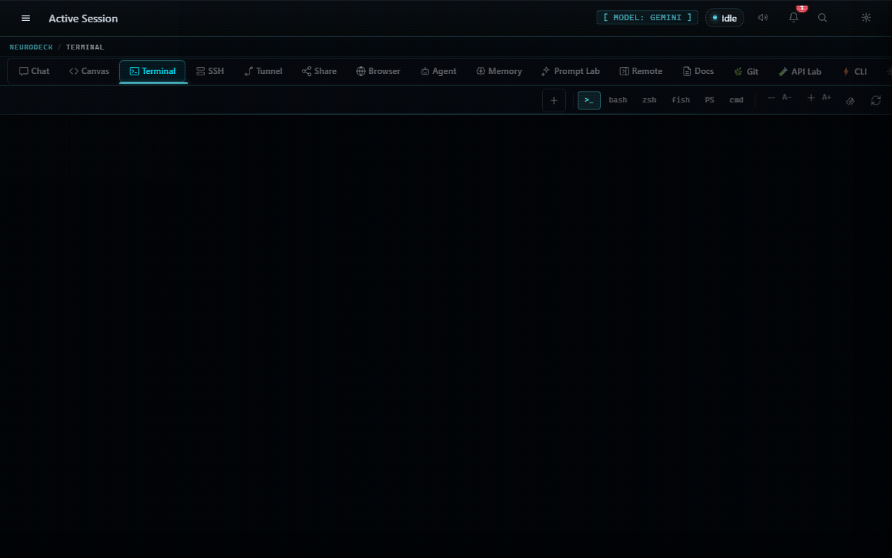

<div align="center">

```
███╗   ██╗███████╗██╗   ██╗██████╗  ██████╗ ██████╗ ███████╗ ██████╗██╗  ██╗
████╗  ██║██╔════╝██║   ██║██╔══██╗██╔═══██╗██╔══██╗██╔════╝██╔════╝██║ ██╔╝
██╔██╗ ██║█████╗  ██║   ██║██████╔╝██║   ██║██║  ██║█████╗  ██║     █████╔╝
██║╚██╗██║██╔══╝  ██║   ██║██╔══██╗██║   ██║██║  ██║██╔══╝  ██║     ██╔═██╗
██║ ╚████║███████╗╚██████╔╝██║  ██║╚██████╔╝██████╔╝███████╗╚██████╗██║  ██╗
╚═╝  ╚═══╝╚══════╝ ╚═════╝ ╚═╝  ╚═╝ ╚═════╝ ╚═════╝ ╚══════╝ ╚═════╝╚═╝  ╚═╝
```

### AI-Powered Terminal OS for Steam Deck

[](LICENSE)
[](https://www.rust-lang.org/)
[](https://tauri.app/)
[](https://www.steamdeck.com/)
[](https://ai.google.dev/)
[](https://github.com/khaoticdev62/NEURODECK/releases)
[](https://github.com/khaoticdev62/neurodeck-plugins)

**[Download](https://github.com/khaoticdev62/NEURODECK/releases)** &nbsp;·&nbsp; **[User Guide](docs/USER_GUIDE.md)** &nbsp;·&nbsp; **[Plugin Registry](https://github.com/khaoticdev62/neurodeck-plugins)** &nbsp;·&nbsp; **[Roadmap](docs/ROADMAP_v1.5.0-Horus.md)**

</div>

---

<div align="center">


*Cinematic boot sequence — real system state, live plugin loading, LLM health check.*

</div>

---

## ⚡ What Is NEURODECK?

NEURODECK is a **fullscreen desktop app** that turns a Steam Deck (or any Linux/Windows machine) into a purpose-built AI workstation — all inside a single 1280×800 window designed for the Deck's screen.

**In plain English:** Imagine if your terminal, an AI chatbot, a live code editor, an SSH client, a file transfer tool, a browser, and an autonomous coding agent all lived in one app — switchable with your gamepad's left thumb, no keyboard required. That is NEURODECK.

The backend is **Rust + Tauri v2**. The frontend is **vanilla JavaScript** — no React, no Vue, zero npm bloat. AI runs through Google Gemini (streaming SSE) or any local Ollama model. A Lua plugin API lets you extend it with a single `.lua` file drop. 

Built to be used from a couch, in Game Mode, with a controller in your hands.

---

## 🌌 The Interface

<div align="center">


*Chat tab — AI assistant with contextual prompt cards, RAG memory injection, and multi-persona switching.*

</div>

---

## 🦾 Core Superpowers

NEURODECK replaces 8 different developer tools with a unified, controller-navigable interface:

> ### 💬 **LLM Chat + RAG Memory**
> Full streaming chat with Gemini or Ollama. Past conversations and your own docs are silently injected into every reply via cosine-similarity vector memory — no copy-paste, no re-explaining.

> ### 🧪 **Prompt Lab & Visual Formula Builder**
> Interactively build prompts using industry-standard formulas (AIDA, SCQA, PASTOR, Chain-of-Thought, PAS). Features a template gallery and a JPE (Justification, Purpose, Expectation) explanation pane backed by the active LLM.

> ### 🎮 **DeckCode Smart Snippets**
> Press a gamepad sequence to instantly trigger macros, open terminals, or send prompts. Dynamically inject multi-language code blocks straight into your IDE or Canvas and intelligently set your cursor using `${cursor}` placeholders.

> ### 🤖 **Autonomous Agent Loop**
> Give it a task in plain English. It writes code, runs it, reads the output, and iterates — up to 5 steps, fully observable in real time.

> ### 💻 **Real PTY Shell & IDE**
> Multi-session Bash/Zsh with full process control, ANSI colors, and AI autocomplete on `Ctrl+Space`. Plus, a mini IDE equipped with an LSP client.

> ### 🌐 **SSH & FTP Profiles**
> Built-in SSH client and FTP/SFTP manager with persistent connection profiles and drag-and-drop file transfers.

> ### 🎨 **Live Code Canvas**
> Write HTML/CSS/JS and see it render instantly, split-pane. LAN canvas collaboration allows you to host a session where peers can edit together in real time.

> ### 📤 **Zero-Cloud LAN Ecosystem**
> Warpinator-compatible P2P file transfers over mDNS, WebSocket iPhone remote control, and local Torrents. All running directly on your LAN.

---

## 🧩 Lua Plugin API

NEURODECK is dynamically extensible via Lua 5.4. Drop a `.lua` file into the `plugins/` directory, and it will auto-load on startup.

- **Register Shell Commands:** Add custom `/commands` to the chat.
- **Hook System Events:** Intercept UI events, LLM streaming, and PTY outputs.
- **Define Custom Personas:** Create multi-agent personalities with custom system prompts (like the built-in BMAD agents).

---

## 🏛️ Architecture & Standards

- **Khaotic Foundation Metadata Standard (KFMS v1.0):** Strict release gating, automated `meta.json` governance, and semantic versioning driven by Egyptian god codenames (v1.5.0 = Horus).
- **Zero-Bloat Frontend:** Written entirely in Vanilla HTML/CSS/JS. No React, no bundler overhead in production, pure DOM manipulation for maximum performance on handheld devices.
- **Tauri IPC:** Native capabilities (filesystem, network, PTY, Bluetooth) are handled by a lightweight Rust backend.

---

## 🖥️ Feature Visuals

<table>
<tr>
<td align="center" width="50%">


**Chat** — Streaming response with syntax-highlighted code blocks, Copy / Send to Canvas / Execute action buttons per block.

</td>
<td align="center" width="50%">


**Canvas** — Split-pane live HTML/CSS/JS editor.

</td>
</tr>
<tr>
<td align="center" width="50%">


**Terminal** — Multi-session PTY shell.

</td>
<td align="center" width="50%">


**SSH** — Built-in client with saved profiles.

</td>
</tr>
<tr>
<td align="center" width="50%">


**Browser** — Native WebView overlay with speed-dial bookmarks.

</td>
<td align="center" width="50%">


**Agent** — 5-step autonomous loop.

</td>
</tr>
<tr>
<td align="center" width="50%">


**Prompt Lab** — Visual formula builder.

</td>
<td align="center" width="50%">


**Share** — LAN P2P file transfer via mDNS.

</td>
</tr>
<tr>
<td align="center" width="50%">


**Remote** — WebSocket server + QR code for mobile control.

</td>
<td align="center" width="50%">


**Diagnostics & Manual** — Real-time backend capability checks and health metrics.

</td>
</tr>
</table>

---

## 🚀 Quick Start

> **Prerequisites:** [Rust 1.77.2+](https://rustup.rs/), [Node.js 18+](https://nodejs.org/), and either a `GEMINI_API_KEY` set or [Ollama](https://ollama.com/) running locally.

```bash
git clone https://github.com/khaoticdev62/NEURODECK.git && cd NEURODECK
npm install --prefix frontend

# Linux / macOS / SteamOS
export GEMINI_API_KEY="AIza..."

# Windows PowerShell
$env:GEMINI_API_KEY = "AIza..."

npm run tauri dev
```

**First build: 2–3 minutes.** `mlua` compiles Lua 5.4 from source (vendored). Every build after that is fast.

---

## 🎮 Gamepad Navigation

The entire app is controllable with a Steam Deck controller — designed for couch sessions and Game Mode.

| Input | Action |
|---|---|
| <kbd>L2</kbd> **(hold)** | Open the 12-segment radial menu |
| <kbd>Left Stick</kbd> | Highlight a radial segment (tab) |
| <kbd>L2</kbd> **(release)** | Jump to the highlighted tab |
| <kbd>D-Pad</kbd> | Navigate inner tabs (e.g., multiple SSH sessions) |
| <kbd>\`</kbd> **(Backtick)** | Open / close radial menu from keyboard |
| <kbd>Enter</kbd> **(radial open)** | Activate highlighted segment |

To enable full controller support in Steam Game Mode, load the NEURODECK Steam Input profile described in [`docs/steam_input_guide.md`](docs/steam_input_guide.md).

---

## 🧩 The Lua Plugin System

Drop any `.lua` file into `plugins/`. NEURODECK loads it at startup via `mlua` (Lua 5.4, compiled from source). Available globals:

```lua
print("hello from lua")
execute("any_bash_command")
registerCommand("/mycommand", function(args) ... end)
registerHook("before_send", function(msg) return msg end)
setPersona("developer")
```

The built-in **Plugin Marketplace** tab (inside Settings → Plugins) connects to the [neurodeck-plugins](https://github.com/khaoticdev62/neurodeck-plugins) registry. Browse, search by tag, and install plugins without leaving the app.

---

## 🔮 What's Next — v1.5.0 Horus

> Roadmap: [`docs/ROADMAP_v1.5.0-Horus.md`](docs/ROADMAP_v1.5.0-Horus.md)

**Theme: Vision — Surface the Intelligence Layer.**  
Horus brings several dormant background systems into the light, polishing and expanding existing mechanics:

| Theme | Enhancements |
|---|---|
| **LSP Intelligence** | Full client wired to the IDE view with completions, hover, and diagnostics. |
| **Peer Connectivity** | The Torrent/P2P pipeline is finally unlocked, alongside Remote Control session QR code flows. |
| **Integrations** | Model Context Protocol (MCP) tool bindings and vector memory backup/export paths. |

---

## ⚖️ License & Open Source

**NEURODECK** itself is distributed under a **Proprietary / EULA License** (see [`LICENSE`](LICENSE)). 

NEURODECK heavily leverages open-source technology, and we are grateful to the broader community. The **"About"** section within the Settings Modal provides full attributions and licenses for Tauri (MIT/Apache 2.0), Vite (MIT), Rust Crates, xterm.js, and marked.js.

---

<div align="center">

**Built for the Steam Deck. Runs anywhere.**

`com.neurodeck.app` &nbsp;·&nbsp; v1.5.0-Horus &nbsp;·&nbsp; KFMS Codename: Horus

[github.com/khaoticdev62/NEURODECK](https://github.com/khaoticdev62/NEURODECK)

</div>
