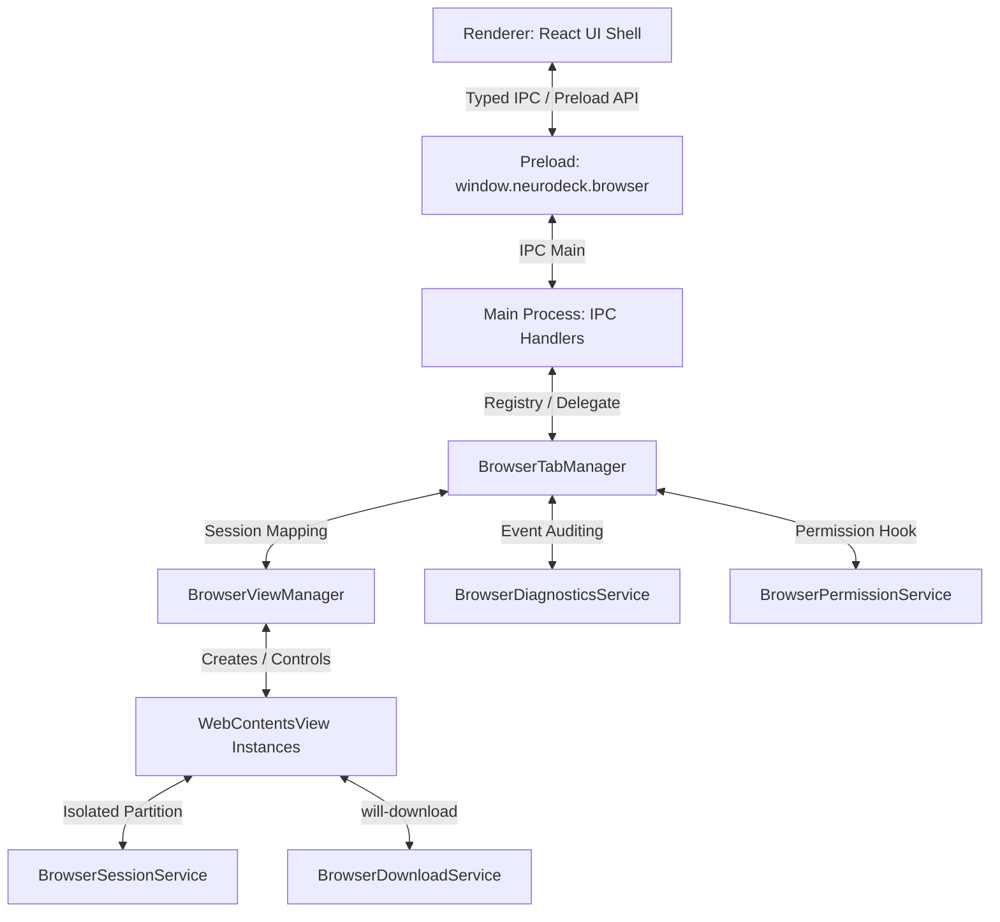

# NeuroBrowse Architecture

This document describes the design and flow of the new Chromium-class **NeuroBrowse** subsystem inside NEURODECK.

## 1. Process Separation and Preload Scope
- **App Shell**: The main NEURODECK window runs under secure defaults: `nodeIntegration: false`, `contextIsolation: true`, `sandbox: true`, and loads the main preload script exposing `window.neurodeck.*` APIs.
- **Remote Guest Viewports**: Webpages loaded inside browser tabs are isolated in individual `WebContentsView` instances.
- **Security isolation**: Guest views do NOT load the NEURODECK preload script, nor do they have access to any Node/Electron/NEURODECK APIs. They are fully sandboxed.

## 2. Browser Tab System Manager
- The `BrowserTabManager` keeps track of active tabs.
- Each tab is associated with a unique `BrowserTabId` and maps to a `WebContentsView` instance managed by `BrowserViewManager`.
- Only the currently active tab's `WebContentsView` is attached to `mainWindow.contentView` and marked visible; others are detached and hidden to save CPU/GPU cycles.

## 3. Session Isolation & Profiles
- Five distinct profiles are supported: `Default`, `Private`, `Research`, `Developer`, and `Sandbox`.
- Each profile uses a separate Electron partition (e.g. `persist:nb-default`, `nb-private` for in-memory, etc.).
- This isolates cookies, local storage, history, and cache.
